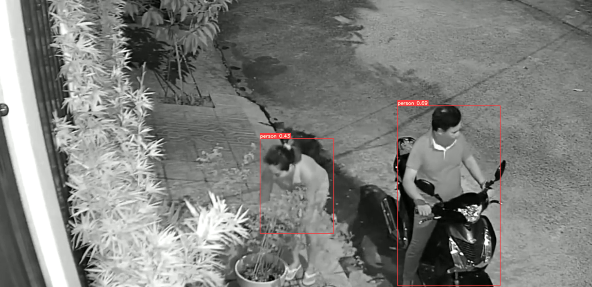

# Run Yolov5 person detector with Docker
Deploy yolov5 with flask restful api on nvidia-docker for person detection

## Usage
1. Build docker
   ```shell
    $ cd detection_server
    $ docker build -t detection .
   ```
   Then, the detection docker image can be found when you exec *docker images* command.
2. Create container with detection image
   ```shell
    $ docker run -d --gpus device=0 -p 5001:5001 detection
    ```
    Which starts a http server to privide detection service on 5001 port of the container, and forwards the port to the same port on host.
3. Run detection

    Send http request to the port on your host to get detection results, the example code can be found at  *detection_client/post_detection.py*
## Example result


## Contact me
jianglx@whu.edu.cn
